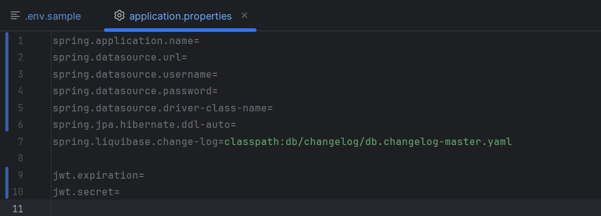
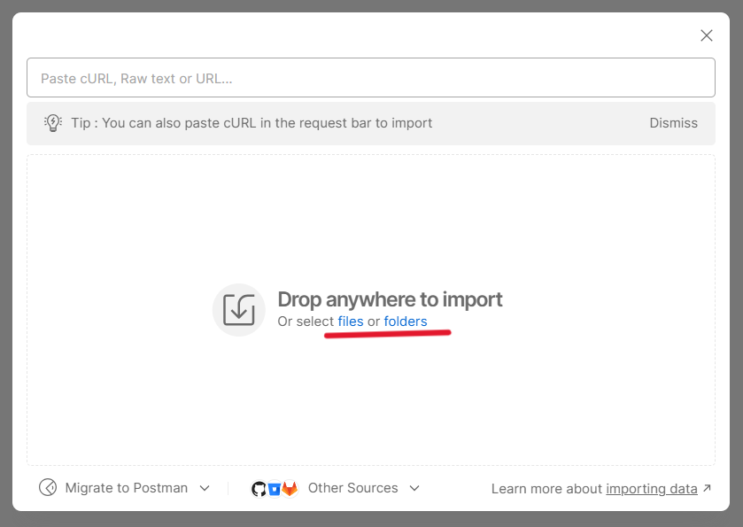
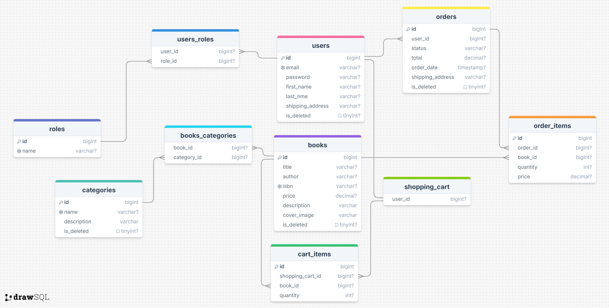

## Table of Contents
1. [Project Overview](#project-overview)
2. [Requirements](#requirements)
3. [How to Run](#how-to-run)
4. [Project Structure](#project-structure)
5. [Key Features](#key-features)
6. [Technology used](#technology-used)
7. [Postmen and Swagger](#postman-and_swagger)
8. [Database Schema and Relationships](#database schema and relationships)

---

## Project Overview
**Book Store API** is a RESTful web application designed to manage an online bookstore. It provides basic features like:
- Viewing the catalog of books.
- Managing user shopping carts.
- Placing orders.
- Managing user roles (Admin/User).

This project is built using Spring Boot and uses MySQL as the database for storing data.

---

## Requirements
- **Java** 17 or later
- **Maven** 3.6 or later
- **MySQL** 8.0 or later
- **Postman** (optional, for API testing)

---

## How to Run

1. **Clone the repository**  
   Download the project using the following command:
   ```bash
   git clone https://github.com/layzimayner/book-store.git

2. **Navigate to the project directory**
   ```bash
   cd book-store

3. **Install dependencies**
   ```bash
   mvn clean install

4. **Add configuration**
   Add an application.properties file to the src/main/resources directory with the following settings:


5. **Run the project**
   ```bash
   mvn spring-boot:run

---

## Project Structure

book-store/
├── src/
│   ├── main/
│   │   ├── java/com/example/demo/
│   │   │   ├── annotation/      # Custom annotations
│   │   │   ├── config/          # Project configurations
│   │   │   ├── controller/      # REST controllers
│   │   │   ├── dto/             # Data Transfer Objects (DTOs)
│   │   │   ├── exception/       # Custom exceptions and handlers
│   │   │   ├── mapper/          # MapStruct mappers
│   │   │   ├── model/           # Database entities
│   │   │   ├── repository/      # JPA repositories
│   │   │   ├── service/         # Business logic services
│   │   │   └── Application      # Main entry point
│   │   └── resources/
│   │       ├── application.properties   # Configuration file
│   │       ├── db.changelog/            # Liquibase changelog files
│   │       ├── screenshots/             # Screenshots for README
│   │       └── postmanCollection/       # Postman collections for API testing
│   └── test/
│       ├── java/com/example/demo/       # Unit and integration tests
│       ├── resources/
│       │   ├── application.properties   # Test-specific configuration
│       │   └── database/scripts/        # SQL scripts for testing
├── pom.xml          # Maven build file
└── README.md        # Project documentation


___

## Key Features
1. User Registration and Authentication:
    Users can register and  log in.
2. Book Management:
    Create, update, delete and find books from DB
3. Cart Management:
    Add, remove, and view items in the shopping cart.
4. Order Management:
    Place orders and view order history.
5. Categories Management:
    Create, update, delete, find and sort books by it categories

---

## Technology used
The project is built on Spring, with the addition of Boot, Security, and Data JPA,
aimed at reducing boilerplate code and simplifying testing. To ensure the security
of all sensitive data and maintain the stateless nature of the application,
I implemented JWT tokens .Here is the entire list of frameworks/libraries:  

Core Technologies:
1. Spring Boot 3.3.4 :
  * spring-boot-starter-web
  * spring-boot-starter-data-jpa
  * spring-boot-starter-security
  * spring-boot-starter-test
  * spring-boot-maven-plugin

2. Databases:
  * liquibase-core Inherited from Spring Boot Parent
  * mysql-connector-j 8.0.33
  * h2 Inherited from Spring Boot Parent

3. Validation:
  * hibernate-validator 8.0.1.Final

4. Security:
  * jjwt (JSON Web Token) 0.11.5
  * spring-security-test Inherited from Spring Boot Parent

5. Mapping:
  * MapStruct 1.5.5.Final
  * Lombok MapStruct Binding: 0.2.0

6. Documentation:
  * springdoc-openapi-starter-webmvc-ui 2.6.0

7. Testing:
  * Testcontainers 1.18.0
  * JUnit Jupiter 5.10.0

8. Tools:
  * maven-compiler-plugin Uses Java version 17 from <java.version> property.
  * maven-checkstyle-plugin 3.3.0

---

## Postman and Swagger

The inclusion of Swagger provides the ability to interactively
test how the application works(http://localhost:8080/swagger-ui.html). You can create a new user
without administrator rights, or use an existing one with extended rights or not
(email = admin@example.com, password = admin; email = user@exampl.com, password = user).
Also, use the user's data in Postman.Here are the instructions for importing a Postman collection:

1. Go to Postman using the provided link(https://www.postman.com/).
2. Click on Import in the Postman interface.
   
3. Select the option to upload a file.
   
4. Locate the desired file using the path:
   book-store\src\main\resources\book store.postman_collection.json

In addition to standard controller endpoints like delete, create, update, find by ID, and get all,
the project also includes publicly accessible endpoints such as:

* POST auth/login and POST auth/register

More specific endpoints include:

* GET category/{categoryId}/books
  Returns a list of books that belong to the category specified by categoryId.

* POST orders
  Requires an authenticated user to create an order based on their account and shopping cart.

---

## Database Schema and Relationships



---

As my first project, it raised many questions and challenges, especially during the testing phase.
However, thanks to advice from kind and supportive individuals and my eagerness to learn,
I am proud to present this work.


